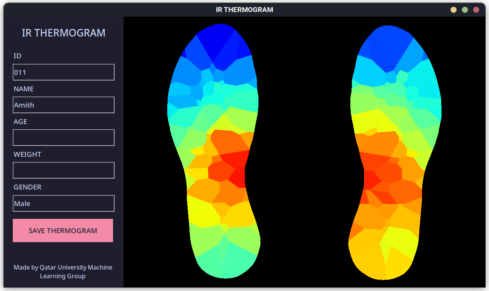

<h1 align="center">
Thermogram Platform App
<p>

</p>
</h1>
<h3 align="center">Generate Foot Thermogram from a Contactless Temperature Sensor Platform</h3>

<p align="center">
    <a href="https://github.com/atick-faisal/Thermogram-Platform-App/releases"></a>
    <a href="https://github.com/atick-faisal/Thermogram-Platform-App/issues"></a>
    <a href="https://github.com/atick-faisal/Thermogram-Platform-App/contributors"></a>
</p>

<p align="center">
  
</p>


### Download
<p align="center">
  <a href="https://github.com/atick-faisal/Thermogram-Platform-App/releases/download/v1.0.1/thermogram_platform_v1.0.1.zip">
    
  </a>
</p>
<p align="center">Download for Windows 10/11</p>


### Installation
1. Download and extract the archive
2. Move into the `driver` directory inside the extracted folder
3. Right click on the `silabser.inf` file and click `install`
4. (Optional) Restart the computer
5. Connect the Thermogram Platform via USB cable
6. Run the `main.exe` file inside the extracted folder


### Development
1. Clone the repository
2. Install dependencies

```
  pip install pillow
  pip install numpy
  pip install pandas
  pip install scikit-learn
  pip install pyserial
  pip install opencv-python
```

<p align="center"></p>
<p align="center"><a href="https://sites.google.com/view/mchowdhury" target="_blank">Qatar University Machine Learning Group</a>
<p align="center"><a href="https://github.com/catppuccin/catppuccin/blob/main/LICENSE"></a></p>
